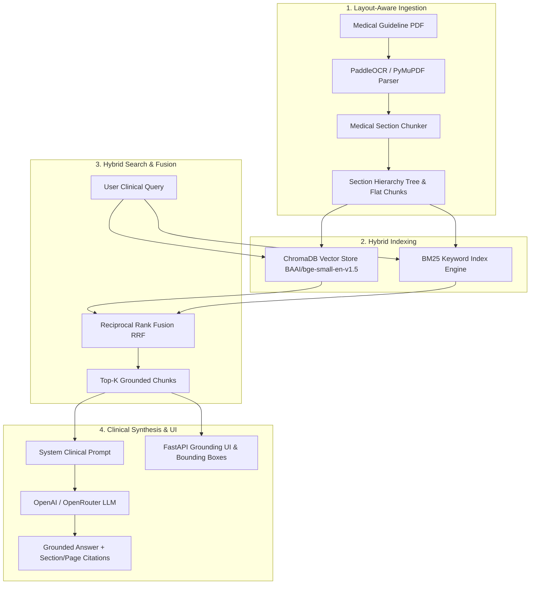

# 🏥 Medical RAG — End-to-End Clinical Decision Support Engine

[](https://www.python.org/)
[](https://fastapi.tiangolo.com/)
[](https://www.trychroma.com/)
[](https://huggingface.co/BAAI/bge-small-en-v1.5)
[](LICENSE)

An evidence-grounded **Retrieval-Augmented Generation (RAG)** decision support system for clinical practice guidelines (e.g., WHO and NICE guidelines for **Hypertension** and **Type 2 Diabetes**). 

The platform features layout-aware document ingestion, section hierarchy chunking, hybrid vector/keyword search with Reciprocal Rank Fusion (RRF), zero-hallucination clinical synthesis with explicit section & page citations, interactive visual bounding box grounding overlays, and a quantitative evaluation framework.

---

## 📋 Table of Contents

- [🎯 System Goals](#-system-goals)
- [🧩 Architecture & Pipeline](#-architecture--pipeline)
- [📁 Project Structure](#-project-structure)
- [⚙️ Centralized Configuration](#%EF%B8%8F-centralized-configuration)
- [🚀 Quick Start Guide](#-quick-start-guide)
- [💻 Usage & Pipelines](#-usage--pipelines)
  - [1. Web Application & Visual Grounding UI](#1-web-application--visual-grounding-ui)
  - [2. Clinical Retrieval CLI](#2-clinical-retrieval-cli)
  - [3. Universal Document Ingestion](#3-universal-document-ingestion)
  - [4. Quantitative Evaluation Suite](#4-quantitative-evaluation-suite)
- [🌐 REST API Reference](#-rest-api-reference)
- [📊 Evaluation Metrics](#-evaluation-metrics)

---

## 🎯 System Goals

Standard Large Language Models (LLMs) often suffer from clinical hallucinations, missing exact page contexts, and an inability to trace citations back to source documents. This Medical RAG engine solves these limitations through:

1. **Layout-Aware PDF Ingestion**: Preserves physical document structure, visual page numbers, page offsets (accounting for cover pages/TOC), section headers, and bounding box coordinates.
2. **Hierarchical Section Chunking**: Splits medical guidelines into token-bounded chunks (400–800 tokens) while maintaining section breadcrumbs (e.g., `Guideline > Pharmacological Treatment > First-line Therapy`).
3. **Hybrid Retrieval (Dense + Sparse)**: Blends semantic vector search (`BAAI/bge-small-en-v1.5` in ChromaDB) with keyword search (BM25) via **Reciprocal Rank Fusion (RRF)** ($k=60$).
4. **Evidence-Grounded Generation**: Enforces strict clinical prompts where answers must cite exact sections and physical page numbers (`[Section 1.4.2, Page 15]`), defaulting to explicit fallback statements if evidence is absent.
5. **Visual Evidence Grounding UI**: Highlights exact bounding boxes on rendered document pages inside an interactive web interface.

---

## 🧩 Architecture & Pipeline



---

## 📁 Project Structure

```text
AI-Hackathon/
├── data/
│   ├── raw/                 # Source PDF guideline documents
│   ├── ocr/                 # Raw OCR markdown (.md) & layout JSON extractions
│   ├── processed/           # Section-aware structured JSON outputs for RAG
│   ├── eval_dataset.json    # Benchmark evaluation dataset
│   └── eval_results.json    # Quantitative evaluation benchmark report
├── chroma_db/               # Persistent ChromaDB vector database
├── src/
│   ├── config.py            # Centralized configuration (paths, models, token bounds)
│   ├── api/
│   │   └── server.py        # FastAPI web server & REST endpoints
│   ├── ingestion/
│   │   ├── pdf_parser.py    # PyMuPDF4LLM page-aware parser
│   │   ├── chunker.py       # Section-aware chunking engine
│   │   └── paddle_section_parser.py # Multi-pattern section detection engine
│   ├── retrieval/
│   │   ├── vector_store.py  # ChromaDB manager with BGE embeddings
│   │   ├── hybrid_search.py # BM25 engine & Reciprocal Rank Fusion
│   │   └── retriever.py     # Unified retrieval engine interface
│   ├── generation/
│   │   └── generator.py     # Grounded LLM generator & citation synthesizer
│   ├── evaluation/
│   │   └── evaluator.py     # Hit Rate, MRR, Precision, Recall, Faithfulness metrics
│   └── ui/
│       └── index.html       # Visual Evidence Panel frontend (HTML5/JS/CSS3)
├── run_full_pipeline.py      # Entry point: Starts FastAPI Web Server & UI Panel
├── run_retrieval_pipeline.py # CLI entry point: Run retrieval queries
├── run_paddle_pipeline.py    # CLI entry point: Run section detection pipeline
├── run_evaluation.py         # CLI entry point: Run evaluation suite
├── ingest_document.py       # Universal document ingestion CLI tool
├── main.py                  # Day-1 ingestion test runner
├── requirements.txt          # Project dependencies
└── README.md                 # Project documentation
```

---

## ⚙️ Centralized Configuration

All system parameters, models, paths, search weights, and token bounds are managed centrally in [`src/config.py`](file:///home/ahmed/data/AI-Hackathon/src/config.py):

| Parameter | Default Value | Description |
| :--- | :--- | :--- |
| `EMBEDDING_MODEL_NAME` | `BAAI/bge-small-en-v1.5` | Dense embedding model for ChromaDB |
| `MAX_CHUNK_TOKENS` | `600` | Target maximum token limit per chunk |
| `MIN_CHUNK_TOKENS` | `30` | Minimum token threshold before chunk merging |
| `CHUNK_OVERLAP_TOKENS` | `100` | Overlap token size for split sections |
| `RRF_K_CONSTANT` | `60` | Rank smoothing constant for Reciprocal Rank Fusion |
| `DEFAULT_LLM_MODEL` | `openai/gpt-4o-mini` | Primary LLM model for synthesis |
| `DEFAULT_PAGE_OFFSET` | `12` | Front-matter offset for physical guideline page sync |

---

## 🚀 Quick Start Guide

### 1. Prerequisites

- **Python 3.10+** installed on your system.
- An **OpenAI API Key** or **OpenRouter API Key**.

### 2. Environment Setup

1. **Clone the repository and enter the directory:**
   ```bash
   cd AI-Hackathon
   ```

2. **Create and activate a virtual environment:**
   ```bash
   python3 -m venv .venv
   source .venv/bin/activate
   ```

3. **Install dependencies:**
   ```bash
   pip install -r requirements.txt
   ```

4. **Configure Environment Variables:**
   Create a `.env` file in the root directory:
   ```env
   OPENAI_API_KEY=your_openai_api_key_here
   # OR
   OPENROUTER_API_KEY=your_openrouter_api_key_here
   ```

---

## 💻 Usage & Pipelines

### 1. Web Application & Visual Grounding UI

Starts the end-to-end FastAPI web server serving both the REST API and the interactive Visual Evidence Grounding Panel:

```bash
python run_full_pipeline.py
```

- **Interactive UI Panel**: Open your browser at [`http://127.0.0.1:8000`](http://127.0.0.1:8000)
- **API Documentation (Swagger)**: Visit [`http://127.0.0.1:8000/docs`](http://127.0.0.1:8000/docs)
- **Health Check**: [`http://127.0.0.1:8000/health`](http://127.0.0.1:8000/health)

---

### 2. Clinical Retrieval CLI

Execute hybrid retrieval queries directly in your terminal to inspect retrieved chunks, RRF fusion scores, and bounding box metadata:

```bash
python run_retrieval_pipeline.py \
  --query "What is the first-line pharmacological treatment for adults with type 2 diabetes?" \
  --top-k 3 \
  --mode hybrid
```

Search modes available: `--mode hybrid`, `--mode dense`, `--mode bm25`.

---

### 3. Universal Document Ingestion

Ingest any medical guideline OCR layout file (`.json` / `.md`) into section-aware chunks and populate ChromaDB:

```bash
python ingest_document.py \
  --json data/ocr/Guideline-for-the-pharmacological-treatment-of-hypertension-in-adults.json \
  --md data/ocr/Guideline-for-the-pharmacological-treatment-of-hypertension-in-adults.md \
  --doc-name "Guideline for the pharmacological treatment of hypertension in adults" \
  --doc-slug "hypertension" \
  --page-offset 12
```

---

### 4. Quantitative Evaluation Suite

Run comparative benchmark evaluations for retrieval performance across `hybrid`, `dense`, and `bm25` search modes, as well as RAG generation quality:

```bash
python run_evaluation.py --top-k 4
```

To run retrieval-only evaluation without calling LLM endpoints:
```bash
python run_evaluation.py --top-k 4 --skip-generation
```

Benchmark reports are automatically saved to `data/eval_results.json`.

---

## 🌐 REST API Reference

| Endpoint | Method | Description |
| :--- | :--- | :--- |
| `GET /` | `GET` | Serves the Visual Evidence Panel frontend HTML |
| `GET /health` | `GET` | Returns API status and currently loaded guideline engines |
| `POST /api/query` | `POST` | Processes clinical query with hybrid retrieval & LLM synthesis |
| `GET /api/sections` | `GET` | Returns document metadata and hierarchical section tree |

### Example API Request (`POST /api/query`)

```bash
curl -X POST "http://127.0.0.1:8000/api/query" \
  -H "Content-Type: application/json" \
  -d '{
    "query": "When should SGLT-2 inhibitors be prescribed?",
    "document": "hypertension",
    "top_k": 4,
    "mode": "hybrid"
  }'
```

### Example API Response JSON

```json
{
  "query": "When should SGLT-2 inhibitors be prescribed?",
  "answer": "SGLT-2 inhibitors are recommended as first-line therapy for adults with type 2 diabetes who have established cardiovascular disease [Section 1.4.2, Page 15].",
  "document_slug": "hypertension",
  "citations": [
    {
      "citation_id": 1,
      "section_number": "1.4.2",
      "section_title": "First-line drug treatment",
      "page_number": 15,
      "pdf_page_number": 27,
      "bounding_boxes": [{"bbox": [77, 199, 696, 250]}],
      "rrf_score": 0.0327
    }
  ]
}
```

---

## 📊 Evaluation Metrics

The evaluation engine measures system performance against ground-truth clinical guidelines:

### Retrieval Metrics
- **Hit Rate @ K**: Percentage of queries where at least one relevant ground-truth section is retrieved in the top-K chunks.
- **Mean Reciprocal Rank (MRR @ K)**: Evaluates the rank position of the first relevant retrieved chunk.
- **Precision @ K**: Fraction of retrieved top-K chunks that are clinically relevant.
- **Recall @ K**: Proportion of all relevant ground-truth sections retrieved in top-K.

### Generation Metrics
- **Faithfulness / Groundedness**: Verifies that every clinical claim in the response is strictly supported by retrieved context.
- **Answer Relevance**: Measures semantic alignment between the clinical query and generated response.
- **Citation Grounding Rate**: Percentage of generated answers containing explicit section/page citations.
